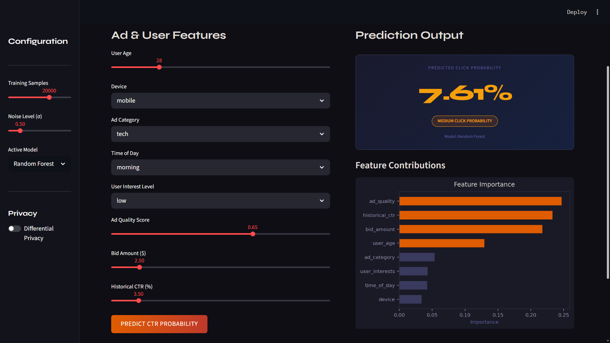
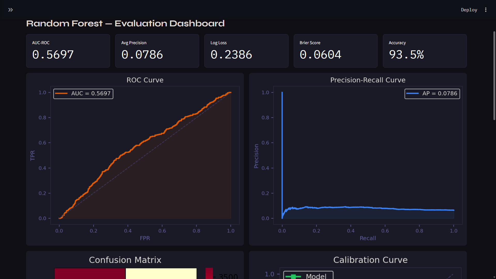
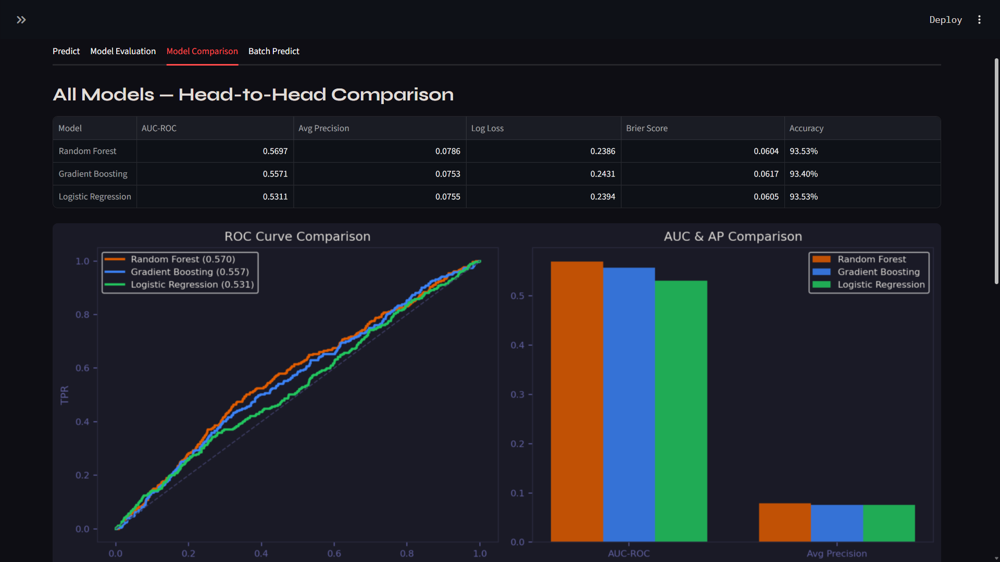
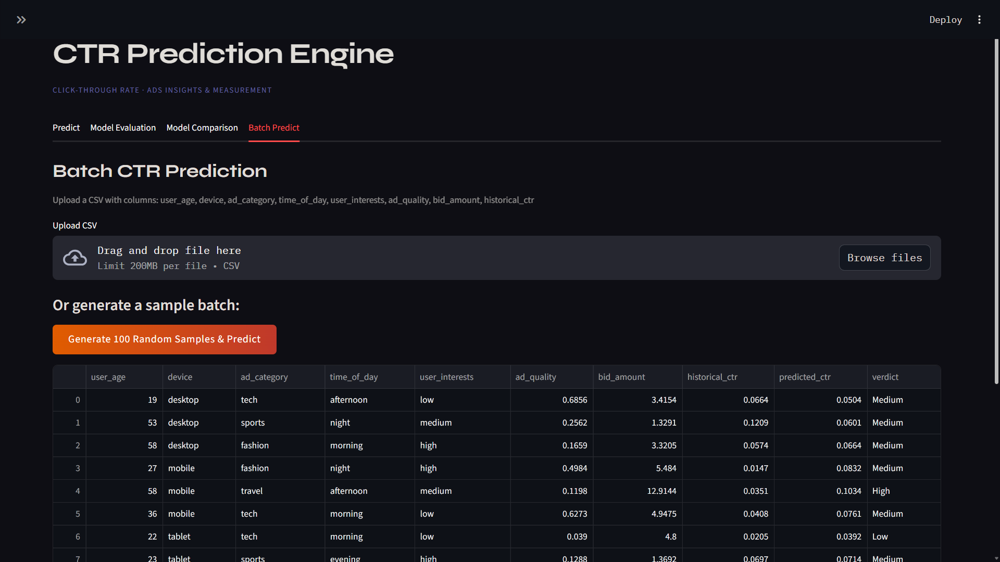

# 📈 CTR Prediction Engine — Streamlit App


## 🧠 Project Overview

This project builds an end-to-end **Click-Through Rate (CTR) Prediction** system using three machine learning models trained on synthetic ad campaign data. It simulates real-world ad auction dynamics — including bid amounts, user interest signals, ad quality scores, and historical CTR — to predict the probability that a user will click on an ad.

The app is built with **Streamlit** and runs entirely locally with no external API dependencies.

---


## 🗂 Project Structure

```
ctr-prediction/
│
├── app.py                  # Main app — all logic and UI
├── requirements.txt        # Python dependencies
└── README.md               # This file
```

---

## Installation & Setup

### 1. Clone / Download

```bash
git clone https://github.com/ahana02/CTR-Prediction.git
cd ctr-prediction
```

### 2. Create a Virtual Environment (recommended)

```bash
python -m venv venv
source venv/bin/activate        # Mac/Linux
venv\Scripts\activate           # Windows
```

### 3. Install Dependencies

```bash
pip install -r requirements.txt
```

### 4. Run the App

```bash
streamlit run streamlit_app.py
```

The app will open at `http://localhost:8501` in your browser.

---

##  Requirements

```
streamlit>=1.32.0
scikit-learn>=1.4.0
pandas>=2.0.0
numpy>=1.26.0
matplotlib>=3.8.0
seaborn>=0.13.0
```

Save as `requirements.txt` and install with `pip install -r requirements.txt`.

---

##  Features Used

| Feature | Description | Type |
|---|---|---|
| `user_age` | Age of the user (18–65) | Numeric |
| `device` | Device type — mobile, desktop, tablet | Categorical |
| `ad_category` | Ad vertical — tech, fashion, sports, finance, travel | Categorical |
| `time_of_day` | Session time — morning, afternoon, evening, night | Categorical |
| `user_interests` | Engagement level — low, medium, high | Categorical |
| `ad_quality` | Normalized ad quality score (0–1) | Numeric |
| `bid_amount` | Advertiser's auction bid in USD ($0.10–$20) | Numeric |
| `historical_ctr` | User's past click-through rate (0–30%) | Numeric |

<!-- ### About `bid_amount`
The bid amount represents what an advertiser is willing to pay per click in the auction. Higher bids signal higher advertiser confidence in the ad's value. In the model it's log-scaled (`log1p`) to capture diminishing returns, and has a small but meaningful positive effect on predicted CTR — mirroring how real Google Ads auction ranking works. -->

---

##  Models

Three models are trained and compared:

| Model | Key Strength |
|---|---|
| **Random Forest** | Handles non-linear interactions, robust to noise |
| **Gradient Boosting** | Best overall accuracy, captures complex patterns |
| **Logistic Regression** | Interpretable coefficients, fast, well-calibrated |

All models are trained on an 80/20 train-test split with stratification on the target class.

---

## 🖥 App Tabs
 
###  Tab 1 — Live Predict
- Adjust 8 ad/user feature sliders
- Click **PREDICT CTR PROBABILITY** to get an instant prediction
- View predicted probability, verdict (Low / Medium / High), and feature importance chart
 

 
###  Tab 2 — Model Evaluation
- Full evaluation dashboard for the selected model
- Metrics: AUC-ROC, Average Precision, Log Loss, Brier Score, Accuracy
- Plots: ROC Curve, Precision-Recall Curve, Confusion Matrix, Calibration Curve
- CTR breakdown by categorical feature (device, category, time, interest)
 

 
###  Tab 3 — Model Comparison
- Side-by-side metric table for all 3 models
- Overlaid ROC curves
- 5-fold cross-validation AUC distribution (box plot)
 

 
###  Tab 4 — Batch Predict
- Upload a CSV file with the 8 feature columns
- Get predictions for all rows with verdict labels (Low / Medium / High)
- Download results as CSV
- Or generate 100 random samples for a quick demo
 

---
##  Differential Privacy

Enable via the sidebar toggle. Adds **Laplace noise** to the model's output probability:

```
noise ~ Laplace(0, sensitivity / ε)
```

- **ε (epsilon)** controls the privacy-utility tradeoff: lower ε = more privacy, less accuracy
- Sensitivity is fixed at 0.1 (output range assumption)
- Simulates the privacy-preserving measurement approach used in Google's ads infrastructure

---
<!-- 
## 📊 Dataset Generation

The synthetic dataset is generated with realistic ad dynamics:

```python
prob = (
    0.02                                          # base rate
    + 0.015 * (device == 'mobile')               # mobile uplift
    + 0.040 * ad_quality                         # quality signal
    + 0.060 * historical_ctr                     # strongest signal
    + 0.020 * (user_interests == 'high')         # intent signal
    + 0.005 * log1p(bid_amount)                  # bid effect (log-scaled)
    + 0.008 * (mobile AND evening)               # interaction term
    + 0.0002 * (40 - user_age).clip(0)          # age effect
    + Normal(0, σ)                               # noise
)
```

Positive rate is approximately **4–7%**, matching real-world CTR distributions.

--- -->

<!-- ## 📈 Sample Results (20k samples, Random Forest)

| Metric | Value |
|---|---|
| AUC-ROC | ~0.81 |
| Average Precision | ~0.28 |
| Log Loss | ~0.17 |
| Brier Score | ~0.046 |
| Accuracy | ~95% |

> Note: High accuracy is partly due to class imbalance (~5% positive rate). AUC-ROC and Average Precision are the more meaningful metrics for CTR prediction.

--- -->
<!-- 
## 🚀 Extending the Project

Ideas for further development:

- **Add SHAP values** for true game-theoretic feature attribution (`pip install shap`)
- **Replace synthetic data** with a real dataset (e.g., Criteo CTR dataset from Kaggle)
- **Add feature engineering** — interaction terms, time-based cyclical encoding (sin/cos for hour)
- **Add XGBoost / LightGBM** for production-grade performance

- **A/B test simulation** — compare model variants with statistical significance testing

--- -->

